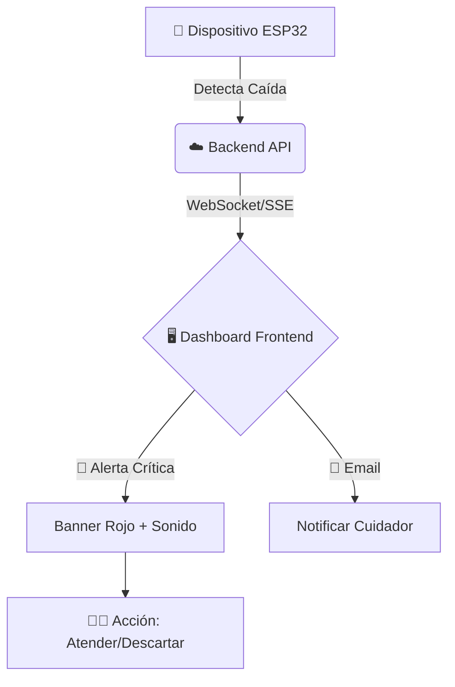

# 🎯 StepGuard IoT - Frontend

Este es el módulo de interfaz web para el sistema de detección de caídas **StepGuard IoT**. Desarrollado con **Angular 18+** utilizando una arquitectura moderna basada en **Signals**, **Control Flow**, y **Standalone Components**.

  

---

## ✨ Cómo Funciona (Walkthrough)

El sistema StepGuard IoT conecta dispositivos de detección de caídas con cuidadores y familiares en tiempo real. Aquí te explicamos el flujo principal.

### 🔄 Flujo de Detección y Alerta

Cuando un dispositivo ESP32 detecta una caída, el sistema responde instantáneamente:



---

## 📖 Guía de Uso del Sistema

### 1. 🔐 Acceso y Seguridad

El sistema cuenta con múltiples métodos de autenticación segura:

- **Login Tradicional:** Email y contraseña.
- **Google Sign-In:** Acceso rápido con tu cuenta de Google.
- **Recuperación:** Si olvidas tu contraseña, puedes restablecerla vía email.

> **Roles Disponibles:**
>
> - `Admin`: Gestión total del sistema y dispositivos.
> - `Cuidador`: Monitoreo de pacientes y recepción de alertas.
> - `Usuario`: Consulta de su propia información.

### 2. 📊 Dashboard de Monitoreo

El panel principal es el centro de control. Aquí verás:

- **Estado del Sistema:** Indicadores globales de salud.
- **Alertas en Tiempo Real:** Las tarjetas de alerta aparecen instantáneamente.
  - 🔴 **Crítica:** Caída confirmada. Requiere atención inmediata.
  - 🟠 **Alta:** Movimiento inusual o pre-alarma.
  - 🟢 **Baja:** Eventos informativos.

_(Espacio para captura: `src/assets/docs/dashboard-preview.png`)_

### 3. 📡 Gestión de Dispositivos IoT

Cada paciente tiene asignado un dispositivo ESP32. Desde la sección de dispositivos puedes:

- **Ver Estado:** `ONLINE` (Conectado) o `OFFLINE` (Sin señal).
- **Batería:** Monitorear el nivel de carga.
- **Ubicación:** Ver la última ubicación reportada.
- **Reiniciar:** Los administradores pueden reiniciar remotamente el dispositivo si es necesario.

### 4. 👥 Gestión de Pacientes

Administra la información de los usuarios del sistema:

- **Perfil Completo:** Datos médicos y de contacto.
- **Historial:** Revisa todas las alertas pasadas de un paciente.
- **Contactos de Emergencia:** Configura a quién avisar en caso de caída.

---

## 🚀 Características Técnicas

### Arquitectura Moderna

- **Signals:** Gestión de estado reactivo granular para máximo rendimiento.
- **Control Flow:** Nueva sintaxis de Angular (`@if`, `@for`) más limpia y rápida.
- **Standalone Components:** Sin `NgModules`, reduciendo el boilerplate.

### UI/UX Profesional

- **Tailwind CSS:** Diseño totalmente personalizado y responsivo.
- **Modo Oscuro/Claro:** (Próximamente).
- **Animaciones:** Transiciones suaves para una mejor experiencia.

---

## 🛠️ Stack Tecnológico

| Area         | Tecnología        | Uso Principal                 |
| ------------ | ----------------- | ----------------------------- |
| **Core**     | Angular 18+       | Framework Frontend            |
| **Lenguaje** | TypeScript 5.9+   | Lógica de negocio tipada      |
| **Estilos**  | Tailwind CSS      | Diseño y Maquetación          |
| **Iconos**   | Lucide Angular    | Iconografía SVG ligera        |
| **Estado**   | Signals & RxJS    | Reactividad y Flujos de datos |
| **Backend**  | Node.js + Express | API REST (Ver repo backend)   |
| **BD**       | Neon PostgreSQL   | Persistencia de datos         |

---

## 📦 Instalación y Desarrollo

### Prerrequisitos

- Node.js 18+
- Angular CLI: `npm install -g @angular/cli`

### Pasos

1.  **Clonar y preparar:**

    ```bash
    git clone <repo-url>
    cd frontend
    npm install
    ```

2.  **Configurar Variables:**
    Asegúrate de que `src/environments/environment.ts` apunte a tu backend local o remoto:

    ```typescript
    export const environment = {
      production: false,
      apiUrl: 'http://localhost:3000/api', // O tu URL de producción
    };
    ```

3.  **Ejecutar:**
    ```bash
    npm start
    # Visita http://localhost:4200
    ```

---

## 🔗 Integración Backend

El frontend consume la API REST segura. Los endpoints clave incluyen:

- `POST /auth/*`: Autenticación y registro.
- `GET /users/*`: Datos de pacientes.
- `GET /devices/*`: Telemetría IoT.
- `GET /alerts/*`: Historial de eventos.

La seguridad se maneja mediante **JWT** (JSON Web Tokens) inyectados automáticamente en cada petición por el `AuthInterceptor`.

---

## 🔐 Credenciales Demo

Para probar el sistema localmente (conectado a BD Neon de producción):

| Rol          | Email                        | Password      |
| ------------ | ---------------------------- | ------------- |
| **Admin**    | `angelgonzalez@gmail.com`    | `123456`      |
| **Cuidador** | `ana.martinez@stepguard.com` | `cuidador123` |
| **Usuario**  | `juan@stepguard.com`         | `user123`     |

---

## 📁 Estructura del Proyecto

```
src/app/
├── components/      # UI Reutilizable (Alertas, Tablas, Modales)
├── pages/          # Vistas Principales (Login, Dashboard, Perfil)
├── services/       # Lógica de Negocio y Comunicación HTTP
├── guards/         # Protección de Rutas
├── interceptors/   # Manejo de Tokens HTTP
└── models/         # Interfaces TypeScript
```
